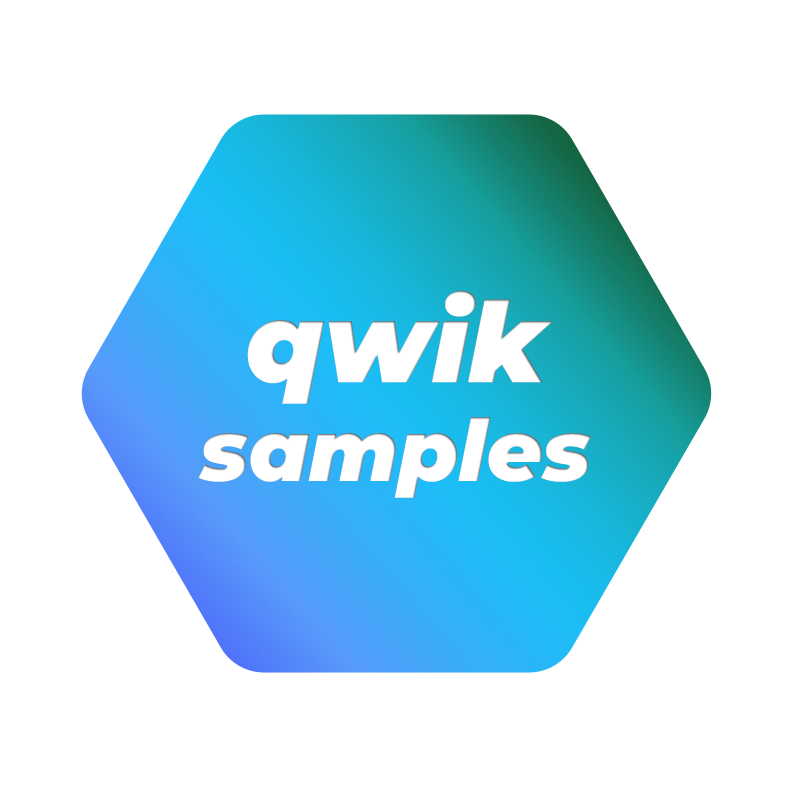

   
  
   

<h1 align='center'>Qwik Samples</h1>

Sample Codes for <a href='https://github.com/BuilderIO/qwik'>Qwik</a>.
  

Table of Contents

<!-- - [Qwik Essentials](#qwik-essentials) -->
- [What's new?](#whats-new)
- [Usage](#usage)
- [Qwik Samples](#qwik-samples)
  - [Components](#components)
  - [Events](#events)
  - [Stores](#stores)
  - [Props](#props)
  - [Reactivity](#reactivity)
  - [Context](#context)
  - [Lifecycle Hooks](#lifecycle-hooks)
  - [Projection](#projection)
  - [Styling](#styling)
  - [$ Optimizer](#-optimizer)
  - [Composing New APIs](#composing-new-apis)
- [Qwik City Samples](#qwik-city-samples)
  - [Routing](#routing)
  - [Layout](#layout)
  - [Data](#data)
  - [Authoring Content](#authoring-content)
  - [Integrations](#integrations)
  - [Prefetching](#prefetching)
  - [Static Site Generation](#static-site-generation)
  - [Head](#head)
- [Mitosis Samples](#mitosis-samples)
- [Partytown Samples](#partytown-samples)
- [Installation](#installation)
- [Contributing](#contributing)
- [Related Links](#related-links)
- [Issues](#issues)

 

## What's new?

| Samples                      | Purpose                                                              |
| ---------------------------- | -------------------------------------------------------------------- |
| `m-xxx`                | WIP                                                            |
## Usage

- WIP

<a href="#toc"><small>Back to Top</small>ꜛ</a>

##  Qwik Samples

### Components

| Samples                      | Purpose                                                              |
| ---------------------------- | -------------------------------------------------------------------- |
| `m-xxx`                | WIP                                                            |

 

<a href="#toc"><small>Back to Top</small>ꜛ</a>

### Events
  
| Samples                      | Purpose                                                              |
| ---------------------------- | -------------------------------------------------------------------- |
| `m-xxx`                | WIP                                                            |

<a href="#toc"><small>Back to Top</small>ꜛ</a>

### Stores
| Samples                      | Purpose                                                              |
| ---------------------------- | -------------------------------------------------------------------- |
| `m-xxx`                | WIP                                                            |

<a href="#toc"><small>Back to Top</small>ꜛ</a>

### Props
| Samples                      | Purpose                                                              |
| ---------------------------- | -------------------------------------------------------------------- |
| `m-xxx`                | WIP                                                            |

<a href="#toc"><small>Back to Top</small>ꜛ</a>

### Reactivity
| Samples                      | Purpose                                                              |
| ---------------------------- | -------------------------------------------------------------------- |
| `m-xxx`                | WIP                                                            |

<a href="#toc"><small>Back to Top</small>ꜛ</a>

### Context
| Samples                      | Purpose                                                              |
| ---------------------------- | -------------------------------------------------------------------- |
| `m-xxx`                | WIP                                                            |

<a href="#toc"><small>Back to Top</small>ꜛ</a>

### Lifecycle Hooks
| Samples                      | Purpose                                                              |
| ---------------------------- | -------------------------------------------------------------------- |
| `m-xxx`                | WIP                                                            |

<a href="#toc"><small>Back to Top</small>ꜛ</a>

### Projection
| Samples                      | Purpose                                                              |
| ---------------------------- | -------------------------------------------------------------------- |
| `m-xxx`                | WIP                                                            |

<a href="#toc"><small>Back to Top</small>ꜛ</a>

### Styling
| Samples                      | Purpose                                                              |
| ---------------------------- | -------------------------------------------------------------------- |
| `m-xxx`                | WIP                                                            |

<a href="#toc"><small>Back to Top</small>ꜛ</a>

### $ Optimizer
| Samples                      | Purpose                                                              |
| ---------------------------- | -------------------------------------------------------------------- |
| `m-xxx`                | WIP                                                            |

<a href="#toc"><small>Back to Top</small>ꜛ</a>

### Composing New APIs
| Samples                      | Purpose                                                              |
| ---------------------------- | -------------------------------------------------------------------- |
| `m-xxx`                | WIP                                                            |

<a href="#toc"><small>Back to Top</small>ꜛ</a>

 

## Qwik City Samples

### Routing
| Samples                      | Purpose                                                              |
| ---------------------------- | -------------------------------------------------------------------- |
| `m-xxx`                | WIP                                                            |

<a href="#toc"><small>Back to Top</small>ꜛ</a>

### Layout
| Samples                      | Purpose                                                              |
| ---------------------------- | -------------------------------------------------------------------- |
| `m-xxx`                | WIP                                                            |

<a href="#toc"><small>Back to Top</small>ꜛ</a>

### Data
| Samples                      | Purpose                                                              |
| ---------------------------- | -------------------------------------------------------------------- |
| `m-xxx`                | WIP                                                            |

<a href="#toc"><small>Back to Top</small>ꜛ</a>

### Authoring Content
| Samples                      | Purpose                                                              |
| ---------------------------- | -------------------------------------------------------------------- |
| `m-xxx`                | WIP                                                            |

<a href="#toc"><small>Back to Top</small>ꜛ</a>

### Integrations
| Samples                      | Purpose                                                              |
| ---------------------------- | -------------------------------------------------------------------- |
| `m-xxx`                | WIP                                                            |

<a href="#toc"><small>Back to Top</small>ꜛ</a>

### Prefetching
| Samples                      | Purpose                                                              |
| ---------------------------- | -------------------------------------------------------------------- |
| `m-xxx`                | WIP                                                            |

<a href="#toc"><small>Back to Top</small>ꜛ</a>

### Static Site Generation
| Samples                      | Purpose                                                              |
| ---------------------------- | -------------------------------------------------------------------- |
| `m-xxx`                | WIP                                                            |

<a href="#toc"><small>Back to Top</small>ꜛ</a>

### Head
| Samples                      | Purpose                                                              |
| ---------------------------- | -------------------------------------------------------------------- |
| `m-xxx`                | WIP                                                            |

<a href="#toc"><small>Back to Top</small>ꜛ</a>

 

## Mitosis Samples

| Samples                      | Purpose                                                              |
| ---------------------------- | -------------------------------------------------------------------- |
| `m-xxx`                | WIP                                                            |

<a href="#toc"><small>Back to Top</small>ꜛ</a>

 

## Partytown Samples

| Samples                      | Purpose                                                              |
| ---------------------------- | -------------------------------------------------------------------- |
| `p-xxx`                | WIP                                                            |

<a href="#toc"><small>Back to Top</small>ꜛ</a>

## Installation

<a href="#toc"><small>Back to Top</small>ꜛ</a>

## Contributing

We love contributions! Check out our [contributing docs](./docs/CONTRIBUTING.md) to get more details into how to run this project, the examples, and more all locally.

<a href="#toc"><small>Back to Top</small>ꜛ</a>

## Related Links

- [Qwik Docs](https://qwik.builder.io/)
- [Discord](https://qwik.builder.io/chat)
- [Qwik GitHub](https://github.com/BuilderIO/qwik)
- [@QwikDev](https://twitter.com/QwikDev)
- [Vite](https://vitejs.dev/)
- [Partytown](https://partytown.builder.io/)
- [Mitosis](https://github.com/BuilderIO/mitosis)
- [Builder.io](https://www.builder.io/)
- [Qwik Lottie](https://www.npmjs.com/package/qwik-lottie)
- [Qwik Rive](https://www.npmjs.com/package/qwik-rive)
- [Awesome Qwik](https://github.com/qwik-design/awesome-qwik)
  
<a href="#toc"><small>Back to Top</small>ꜛ</a>

## Issues

Have an issue with using the snippets, or want to suggest new snippets to help make your development life better? Log an issue in our [issues](https://github.com/qwik-design/qwik-samples/issues) tab! You can also browse older issues and discussion threads there to see solutions that may have worked for common problems.
<a href="#toc"><small>Back to Top</small>ꜛ</a>